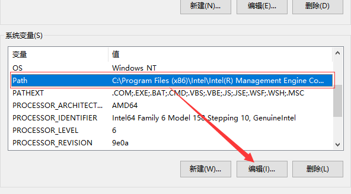
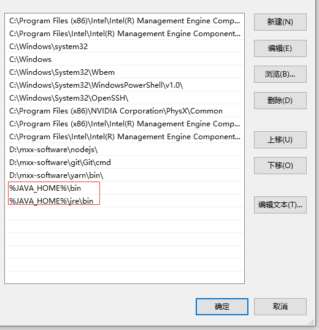

# Window搭建(win10)

## 下载JDK

首先找到对应的版本下载`JDK`：[https://www.oracle.com/technetwork/java/javase/downloads/index.html](https://www.oracle.com/technetwork/java/javase/downloads/index.html)

## 安装JDK

下载完成对应的`JDK`后，就可以安装了，傻瓜式安装，安装时我们选择`开发工具`,并且可以更改一下安装路径

## 环境变量配置

为了方便我们在全局环境中使用`java`，我们现在来配置一下`Java`的全局环境变量:

1. 首先我们先 **右键我的电脑打开控制面板 ——> 点击高级系统设置 ——>  高级 ——> 环境变量**

2. 我们新建一个`JAVA_HOME`环境变量

- 变量名：`JAVA_HOME`
- 变量值(java安装路径)：`D:\mxx-software\java`  这里是我的安装路径

变量值就是`java`的安装路径，这里是我的安装路径，如图：

3. 新建`CLASSPATH`变量，如果存在可以修改

- 变量名：`CLASSPATH`
- 变量值(java安装路径)：`.;%JAVA_HOME%\lib\dt.jar;%JAVA_HOME%\lib\tools.jar;` 

4. 修改`Path`变量

在`Path`变量中加入下面两条路径

- `%JAVA_HOME%\bin`
- `%JAVA_HOME%\jre\bin`

## 检测安装

环境变量添加完成后，我们就可以检测一下在全局环境中是否可以访问`java`, 我们打开`cmd`命令，然后输入`java`, 回车看到下面输出就说明环境配置成功了

