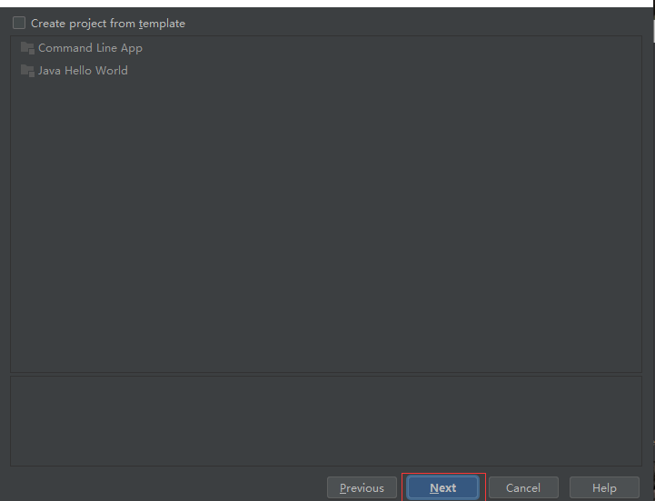
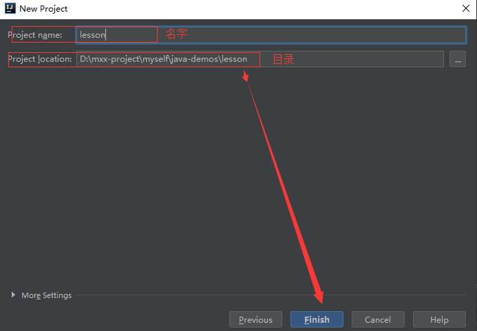
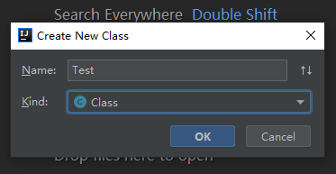
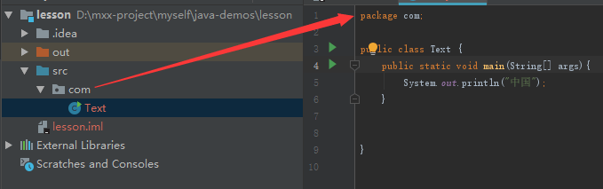

# IDEA工具

`IntelliJ IDEA`是目前比较流行的一个写`java`代码的工具，我们现在来使用它来简单的编写一下`java`程序

## 安装

- 官网下载`idea`:[http://www.jetbrains.com/](http://www.jetbrains.com/)
- 因为`idea`收费，你可以自行下载破解版

## 创建一个java项目

我们使用`idea`来创建一个新项目

## 导入JDK

接下来我么导入`jdk`, 没有下载`jdk`?, 去阅读 [java环境配置](/base/environment_win10.html)

接下来我们就直接下一步就OK了

继续下一步

**然后给我们项目创建名字已经保存路径**

## 创建java文件

接下来我们创建`java`文件

## 编写java程序

编写我们第一个`java`程序

## 运行java程序

接下来我们右击,点击运行来运行我们的第一个`java`,也可以点击右上角的运行;

